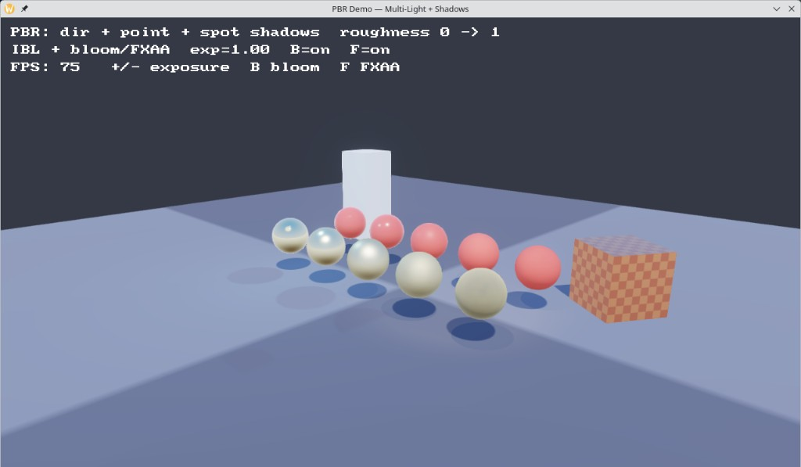

# Game Engine

A commercial-grade 3D game engine built in **D**, designed to match the architectural quality of Rust's Bevy Engine — proving that D is a viable language for high-performance, production game engines.

**WGPU + SDL3 | ECS with SoA Sparse Sets | `@safe` by Default | DIP1000 | MIT**



## Why D?

D sits at the intersection of C++ performance and high-level ergonomics. This engine exploits what makes D uniquely powerful for games:

- **Compile-time metaprogramming** — variadic templates generate zero-overhead ECS stores (`World!(Components...)`), no runtime reflection
- **`@safe` by default** — memory safety without a borrow checker, with `@trusted` escape hatches for C interop
- **DIP1000 scope semantics** — stack-allocated references with compile-time lifetime tracking
- **No mandatory GC in hot paths** — struct-based DOD keeps the GC idle during frame execution. Engine core enforces `@nogc` on the entire frame loop while gameplay systems are free to use the GC for convenience
- **GC-safe storage primitives** — `Pod!T`, `Handle!T`, `StringId`, and `FrameArena` keep engine memory free of GC-traced indirections without giving up gameplay ergonomics
- **ImportC** — Box3D types and structs come straight from C headers (`box3d_import.c` → `public import box3d_import`); thin `pragma(mangle)` wrappers bridge D linkage where needed
- **Direct C interop** — thin manual `extern(C)` bindings for SDL3 and WGPU-native (no bindbc) where we want full control of the GPU/window stack

## Architecture

```
source/
├── bindings/              # C interop (manual extern(C) + ImportC)
│   ├── sdl3.d             # SDL3 — window, events, input, audio
│   ├── wgpu.d             # WGPU-native — GPU resources, render pipeline
│   └── box3d/             # Box3D via ImportC (box3d_import.c + shim)
├── engine/
│   ├── app.d              # Application framework (window + GPU + input loop)
│   ├── assets/            # Disk-to-engine loaders (BMP, glTF, asset files)
│   ├── audio/             # SDL3 audio streams, WAV, AudioEngine/AudioClip
│   ├── core/              # Logging, RAII resources, GC-safe primitives
│   │   ├── pod.d          # isPod!T / Pod!T — compile-time POD gate
│   │   ├── handle.d       # Handle!T — generational typed refs (gameplay→engine)
│   │   ├── strings.d      # StringId + StringTable — interned strings
│   │   ├── arena.d        # FrameArena — per-frame bump allocator
│   │   ├── log.d          # Logging (trace/info/warn/err/fatal)
│   │   └── resource.d     # RAII GPU Handle(T, releaseFn) — move-only resources
│   ├── devtools/          # Immediate-mode gizmos + FPS/label overlay
│   ├── ecs/               # Sparse-set ComponentStore + World!(Components...)
│   ├── editor/            # Scene editor UX (picking, gizmos, inspector, I/O)
│   ├── gpu/               # WGPU context, pipelines, shadows, IBL, post, text
│   ├── graphics/          # Mesh, TexMesh, Texture, Material, primitives
│   ├── math/              # Vec, Mat4, Quat, Ray
│   ├── physics/           # Box3D gameplay API (bodies, queries, joints, character)
│   ├── platform/          # SDL3 window + per-frame input
│   └── scene/             # Camera, controllers, graph, Scene3D (+ textured)
└── demo/
    ├── main.d             # Minimal clear-screen demo
    ├── benchmark.d        # 3D benchmark — 1000 spinning cubes + FPS overlay
    ├── game.d             # Crystal Collector 3D — high-level API demo
    ├── showcase.d         # Solar system — scene graph + textured materials
    ├── pbr.d              # PBR + IBL + shadow PCF demo
    ├── editor.d           # Scene editor (gizmos, hierarchy, scene I/O)
    └── pong3d.d           # Physics gameplay demo (Box3D)
```

### Design Principles

| Principle | Implementation |
|:---|:---|
| **Bevy-like ECS** | Sparse-set stores with compile-time `World!(Components...)` — no vtables, no runtime type lookup |
| **`@safe` by default** | Every module is `@safe:` at top level. C interop wrapped in `@trusted` with minimal surface |
| **Data-Oriented Design** | Components are POD structs in contiguous arrays. Entities are `uint` IDs |
| **Zero-overhead abstractions** | Template systems resolved at compile time. RAII handles for GPU resources |
| **GC discipline** | GC forbidden in engine frame loop (`@nogc`). Allowed in gameplay systems. Components enforce `isPod!T` / `Pod!T` — no GC pointers in engine storage |
| **C interop that fits** | ImportC for Box3D headers; controlled `extern(C)` for SDL3/WGPU |
| **Cross-platform** | SDL3 + WGPU on Linux (Wayland primary, X11 secondary) and Windows |

### ECS — Bevy-Class Performance in D

The ECS is the heart of the engine, inspired by Bevy's sparse-set architecture:

- **`ComponentStore(T)`** — O(1) add/remove/lookup via sparse-set, swap-and-pop removal, dense iteration over contiguous arrays
- **`World!(Components...)`** — variadic template generates one store per component at compile time. Zero runtime overhead for type dispatch
- **Entities** — plain `uint` IDs, no heap allocation, O(1) alive check

```d
// Define a world with your component types
alias GameWorld = World!(Position, Velocity, Sprite, Health);

auto world = GameWorld();
auto player = world.spawn();
world.set(player, Position(0, 0, 0));
world.set(player, Velocity(1, 0, 0));
```

### GPU Stack

| Layer | Technology | Purpose |
|:---|:---|:---|
| Window | SDL3 | Cross-platform window, events (Linux / Windows) |
| GPU API | WGPU-native | Vulkan/Metal/DX12 via WebGPU abstraction |
| Bindings | `extern(C)` | Direct C99 API for SDL3/WGPU — no bindbc |
| Physics | Box3D + ImportC | Types from C headers; thin mangled D wrappers for calls |
| Resources | RAII `Handle(T, releaseFn)` | Move-only GPU wrappers, deterministic release |

### GC Policy — Engine vs Gameplay

The engine uses a **two-layer GC model**, similar to Unity (C++ engine / C# gameplay) but within a single language:

| Layer | GC | Who |
|:---|:---|:---|
| **Engine core** (`engine/`) | Forbidden — `@nogc` on all frame-loop functions | Engine developers |
| **Gameplay** (systems, game logic) | Allowed by default — opt into `@nogc` for perf-critical systems | Game developers |

**Component data is always strict** — `ComponentStore` enforces `isPod!T` at compile time (`Pod!T[]` dense storage), so the GC never scans dense arrays even with thousands of entities. **System logic is free** — gameplay code may allocate, use `string`, `format`, dynamic arrays, and closures. Developers who need maximum performance can mark individual systems `@nogc` and use pre-allocated buffers.

#### GC-safe primitives (`engine.core`)

| Primitive | Role |
|:---|:---|
| **`Pod!T` / `isPod!T`** | Compile-time gate: engine storage may not hold GC-traced indirections |
| **`Handle!T`** | 8-byte generational ref (not the RAII GPU `Handle`) — replaces class pointers across the gameplay→engine boundary |
| **`StringId` + `StringTable`** | Interned 4-byte string IDs — no `string` fields in long-lived engine data |
| **`FrameArena`** | Per-frame bump allocator for scratch buffers and labels (`fmt`), reset in `endFrame()` |

```d
// Gameplay system — GC is allowed, write naturally
void damageSystem(W)(ref W world) {
    int[] toKill;  // GC-allocated dynamic array
    foreach (id; world.query!(Health, DamageReceived)()) {
        auto hp = world.get!Health(id);
        hp.current -= world.get!DamageReceived(id).amount;
        world.set(id, hp);
        if (hp.current <= 0) toKill ~= id;
    }
    foreach (id; toKill) world.destroy(id);
}

// Same system, optimized — opt into @nogc when needed
void damageSystem(W)(ref W world) @nogc nothrow {
    EntityId[128] killBuf = void;
    size_t killCount = 0;
    foreach (id; world.query!(Health, DamageReceived)()) {
        auto hp = world.get!Health(id);
        hp.current -= world.get!DamageReceived(id).amount;
        world.set(id, hp);
        if (hp.current <= 0 && killCount < killBuf.length)
            killBuf[killCount++] = id;
    }
    foreach (id; killBuf[0 .. killCount]) world.destroy(id);
}
```

## Requirements

- **D compiler**: DMD or LDC2
- **SDL3**: `libSDL3.so` (system package or built from source)
- **WGPU-native**: `libwgpu_native.a` in `libs/` (see below)
- **Box3D**: `libbox3d` linked from `libs/`; headers under `vendor/box3d/include` (ImportC via `-P-Ivendor/box3d/include`)
- **OS**: Linux (Wayland primary, X11 secondary) and Windows

## Building

```bash
# Build the demo (clear-screen)
dub build --config=demo

# Build the 3D benchmark (1000 spinning cubes + FPS)
dub build --config=benchmark

# Build the Crystal Collector gameplay demo
dub build --config=game

# Build the solar-system showcase (scene graph + textured materials)
dub build --config=showcase

# Build the PBR + IBL demo
dub build --config=pbr

# Build the scene editor
dub build --config=editor

# Build the physics gameplay demo
dub build --config=pong3d

# Build with optimizations (LDC2 recommended for production)
dub build --config=demo --build=release

# Run
dub run --config=demo
dub run --config=benchmark
dub run --config=game
dub run --config=showcase
dub run --config=pbr
dub run --config=editor
dub run --config=pong3d

# Build as library (for embedding in other projects)
dub build --config=library
```

### Installing WGPU-native

```bash
curl -sL https://github.com/gfx-rs/wgpu-native/releases/latest/download/wgpu-linux-x86_64-release.zip \
  -o /tmp/wgpu.zip
unzip -o /tmp/wgpu.zip -d /tmp/wgpu
cp /tmp/wgpu/lib/libwgpu_native.a libs/
```

## Demos

### Clear-Screen Demo

The minimal proof that the full stack works (SDL3 window → Wayland surface → WGPU instance → adapter → device → render pass → present):

```d
import engine;

void main() {
    auto app = App.create("Game Engine Demo", 1280, 720);
    scope(exit) app.destroy();

    while (app.running) {
        app.pollEvents();
        if (app.input.keyPressed(Key.escape)) app.close();

        auto frame = app.beginFrame(Color(0.05, 0.05, 0.12, 1.0));
        app.endFrame(frame);
    }
}
```

### 3D Benchmark

1000 spinning cubes rendered with instanced drawing, directional N·L lighting, depth buffer, and a real-time FPS overlay using a bitmap font atlas. Runs at **~1800 FPS** on Linux/Vulkan (uncapped, mailbox present mode).

Features demonstrated:
- **Instanced rendering** — per-instance model matrices via vertex attributes (4×vec4)
- **Depth buffer** — depth24Plus with clear-to-1.0
- **WGSL shaders** — vertex transforms + directional lighting in fragment stage
- **Bitmap text** — embedded 8×8 CP437 font atlas (R8Unorm), alpha-blended overlay
- **Uniform buffers** — view-projection matrix uploaded per frame

```bash
dub run --config=benchmark
```

### Crystal Collector

A small 3D gameplay demo — first-person exploration with collectible crystals. Shows the full high-level API: ECS, `Scene3D`, camera controllers, audio cues, and HUD text.

```bash
dub run --config=game
```

### Solar System Showcase

A textured solar system built on the scene graph: planets parented to the sun, moons parented to planets, one-pass world-matrix propagation, textured materials, and directional lighting with shadows.

```bash
dub run --config=showcase
```

### PBR Demo

Cook-Torrance GGX materials, procedural IBL, and shadow PCF on the textured path.

```bash
dub run --config=pbr
```

### Scene Editor

Level editor built on `engine.editor` + `engine.devtools`: picking, TRS gizmos, hierarchy/inspector, lights and shadows, physics simulate, and `*.scene.json` / `*.asset.json` I/O.

```bash
dub run --config=editor
```

### Pong3D (Physics)

Gameplay physics via Box3D — rigid bodies, contacts, and the high-level `engine.physics` API. See [docs/physics-quickstart.md](docs/physics-quickstart.md).

```bash
dub run --config=pong3d
```

## Roadmap

Initial roadmap phases are **complete**, including PBR + IBL + shadow PCF, post-processing (bloom / ACES / FXAA), GC-safe storage + lint, scene editor UX v1, and rigid-body physics via **Box3D** (`engine.physics`).

- [x] Phase 1 — Core stack (SDL3 + WGPU + ECS + math + clear screen)
- [x] Phase 2 — Mesh rendering (vertex/index buffers, WGSL shaders, render pipeline)
- [x] Phase 3 — Instanced rendering, depth buffer, directional lighting
- [x] Phase 4 — Bitmap text rendering, FPS overlay
- [x] Phase 5 — 3D Benchmark (1000 cubes, ~1800 FPS)
- [x] Phase 6 — Materials and textures (RGBA8 textures, samplers, TGA loader, textured pipeline)
- [x] Phase 7 — Scene graph and transforms (parent-indexed hierarchy, one-pass world matrices)
- [x] Phase 8 — 3D camera system (OrbitCamera, FlyCamera, FirstPersonCamera)
- [x] Phase 9 — Shadow map infra (depth32Float + depth-only pipeline + light VP; PCF on textured path)
- [x] Phase 10 — Asset pipeline (BMP + minimal glTF 2.0 mesh loader)
- [x] Phase 11 — Audio (SDL3 audio streams, WAV loading, playback)
- [x] Phase 12 — Editor tooling (immediate-mode 3D gizmos + debug overlay)
- [x] Phase 13 — Physics MVP (Box3D: rigid bodies, sensors, raycast, contact events)
- [x] Phase 14 — PBR + IBL + shadow PCF (`dub run --config=pbr`)
- [x] Phase 15 — Post-processing (HDR scene RT, bloom, ACES, FXAA)
- [x] Phase 16 — GC-safe adoption + lint (`Pod!T`, `Handle!T`, `StringId`, `FrameArena`)
- [x] Phase 17 — Scene editor UX v1 (`dub run --config=editor`)

Active plans and remaining work live under [`docs/`](docs/README.md). Overview: [`docs/roadmap.md`](docs/roadmap.md).

### Next Horizons

Remaining work (see [`docs/roadmap.md`](docs/roadmap.md)):

| # | Feature | Plan |
|---:|:---|:---|
| 1 | Skeletal animation + glTF skin | [docs/plan-animation.md](docs/plan-animation.md) |
| 2 | Terrain + water editor | [docs/plan-terrain-water.md](docs/plan-terrain-water.md) |
| 3 | Hot reload (assets + data) | [docs/plan-scripting-hot-reload.md](docs/plan-scripting-hot-reload.md) |
| 4 | Parallel ECS scheduling | [docs/plan-parallel-ecs.md](docs/plan-parallel-ecs.md) |
| 5 | Networking | [docs/plan-networking.md](docs/plan-networking.md) |

The native Jolt (`engine.jph`) port was **cancelled** in favor of Box3D and
removed from the tree. See [docs/physics-quickstart.md](docs/physics-quickstart.md),
[docs/jph-port-plan.md](docs/jph-port-plan.md), and
[docs/physics-box3d-benchmark.md](docs/physics-box3d-benchmark.md).

## Documentation

- [docs/README.md](docs/README.md) — index of guides and plans
- [docs/roadmap.md](docs/roadmap.md) — remaining work overview
- [docs/game-development-guide.md](docs/game-development-guide.md) — how to build a 3D game with the high-level API
- [docs/physics-quickstart.md](docs/physics-quickstart.md) — Box3D gameplay physics API
- [docs/graphics.md](docs/graphics.md) — GPU architecture and rendering pipeline
- [docs/why-this-is-fast.md](docs/why-this-is-fast.md) — Data-Oriented Design explained for programmers from other languages
- [docs/incremental-gc-research.md](docs/incremental-gc-research.md) — GC pause research and measurements
- [docs/gc-safe-architecture-plan.md](docs/gc-safe-architecture-plan.md) — POD / Handle / StringId / FrameArena plan

## License

[MIT](LICENSE) — Copyright © 2022–2026, Leonardo Tada
